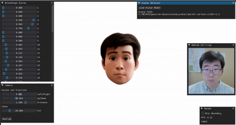
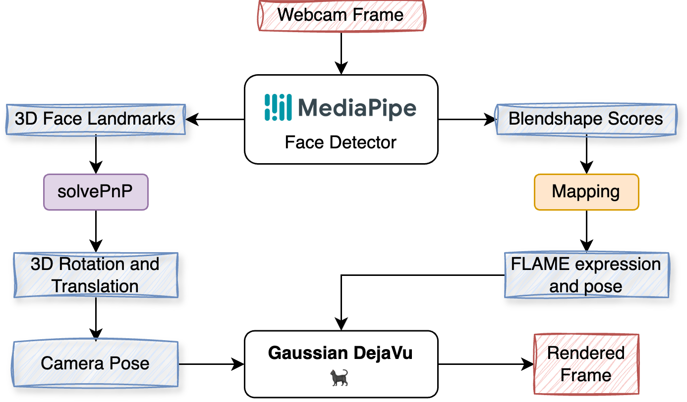

# Gaussian Deja-vu 🐈‍⬛

## **[🚀 Project Homepage](https://peizhiyan.github.io/docs/dejavu/index.html)**

## [](https://opensource.org/licenses/MIT)


- **Author**: Peizhi Yan
- **Current Version**: v1.3

> [!NOTE]
> ### Versions:
> - _Jun-18-2025_: In v1.3, support tracking results from ```flame-head-tracker v3.4```
> - _Jun-09-2025_: In v1.2, support tracking results from ```flame-head-tracker v3.3```
> - _Mar-31-2025_: v1.1 demo. We've added a pre-trained MLP network that maps FLAME expression coefficients to a lower-dimensional (10D in this demo) set of blending weights.
> - _Mar-27-2025_: v1.0 demo. This version matches the method described in our WACV 2025 paper. Please use this version for benchmarking purpose.


## 📺 Demo Videos (Click to Watch)
<div align="center">
  <table>
    <tr>
      <td>
        <b>Viewer</b>
        <a href="https://www.youtube.com/watch?v=Tm7uPEYzfpo">
          
        </a>
      </td>
      <td>
        <b>Webcam Driver</b>
        <a href="https://www.youtube.com/watch?v=j47MnAf9jRo">
          
        </a>
      </td>
    </tr>
  </table>
</div>


**Notations**:
⭐ Important 
❓ Question


⭐ We suggest shallow copy our repo:
```
git clone --depth 1 https://github.com/PeizhiYan/gaussian-dejavu
```


## 💚 Citation

This is the official code repo for our "Gaussian Deja-vu" (accepted for WACV 2025 in Round 1). 

Please consider citing our work if you find this code useful.
```
@InProceedings{Yan_2025_WACV,
    author    = {Yan, Peizhi and Ward, Rabab and Tang, Qiang and Du, Shan},
    title     = {Gaussian Deja-vu: Creating Controllable 3D Gaussian Head-Avatars with Enhanced Generalization and Personalization Abilities},
    booktitle = {Proceedings of the Winter Conference on Applications of Computer Vision (WACV)},
    month     = {February},
    year      = {2025},
    pages     = {276-286}
}
```


## 🧸 How to Use

[Return](#)

⭐ Note that, please set the working directory in the Python code before running it.

For example:

```python
import os, sys
os.environ['CUDA_VISIBLE_DEVICES'] = '0' # Set the visible CUDA, here we use the second GPU
WORKING_DIR = '/home/peizhi/Documents/gaussian-dejavu/'
os.chdir(WORKING_DIR) # change the working directory to the project's absolute path
```

### Prepare Training Data

Please follow https://github.com/PeizhiYan/flame-head-tracker/tree/v3.4 and our example [```./examples/Personal-Video-Precessing.ipynb```](./examples/Personal-Video-Processing.ipynb) to pre-process your video.

> [!WARNING]
> - ```Dejavu v1.3``` is compatible with ```flame-head-tracker v3.4```, not lower versions.
> - ```Dejavu v1.2``` is compatible with ```flame-head-tracker v3.3```, not lower versions.
> - ```Dejavu v1.1``` and ```Dejavu v1.0``` are compatible with ```flame-head-tracker v3.2```

When collecting your video, please consider following this guidance to achieve good reconstruction results [```./assets/personal_video_collection_procedure.pdf```](./assets/personal_video_collection_procedure.pdf)

### Personalize Head Avatar

Please follow our example to train the personalized head avatar model:
- [```./examples/Personalize-Avatar.ipynb```](./examples/Personalize-Avatar.ipynb)

[**Experimental**!] We also tested to train the head avatar model on stylized videos (stylized by vToonify, see [Details](./assets/README-cartoon.md)):
- [```./examples/Personalize-Avatar-cartoon.ipynb```](./examples/Personalize-Avatar-cartoon.ipynb)
<div align="left"> 
  <b></b>
</div>


### Avatar Viewer Demo

```
python run_avatar_viewer.py
```

We have prepared some head avatar models in the folder ```./saved_avatars/```. Please note that, ```imavatar``` models were trained on the IMAvatar dataset (https://github.com/zhengyuf/IMavatar). 


### Realtime Avatar Webcam-Driving Demo

```
python run_avatar_driver.py
```

**Pipeline Diagram:**

<div align="left">
  
</div>

>
> We use Mediapipe's face blendshape scores to drive our avatar.
> We use pre-calculated mappings (https://github.com/PeizhiYan/mediapipe-blendshapes-to-flame) to derive the blendshape scores to FLAME's expression coefficients, jaw pose and eye pose.
>
> **Note that**: The driver demo is not optimized for run-time effieiency, therefore the actual fps will be low and cannot reflect the real-time efficiency of 3DGS.
> 


## 🟠 Environment Setup


### Prerequisites:

- **GPU**: 
  - Nvidia GPU with >= 6GB memory (recommend > 8GB). 
  - Training needs better GPU, >= 24GB memory is recommended. We tested the code on Nvidia A6000 (48GB) GPU.
  - We tested inference on RTX3070.
- **OS**: 
  - **Ubuntu** Linux is highly recommended (we tested on 22.04 LTS and 24.04 LTS).
  - We also tested running the inference code on **Windows** system. However, setting up the environment might be a bit more complex.

⭐ We also suggest you to follow this repo https://github.com/ShenhanQian/GaussianAvatars to setup the environment. Otherwise, you can follow the following steps:


<details>
  <summary>Click to expand ⬇️</summary>

  ### Step 1: Create a conda environment. 

  ```
  conda create --name dejavu -y python=3.10
  conda activate dejavu
  ```

  ### Step 2: Install necessary libraries.

  #### Nvidia CUDA compiler (11.7)

  ```
  conda install -c "nvidia/label/cuda-11.7.1" cuda-toolkit ninja

  # (Linux only) ----------
  ln -s "$CONDA_PREFIX/lib" "$CONDA_PREFIX/lib64"  # to avoid error "/usr/bin/ld: cannot find -lcudart"

  # Install NVCC (optional, if the NVCC is not installed successfully try this)
  conda install -c conda-forge cudatoolkit=11.7 cudatoolkit-dev=11.7
  ```

  After install, check NVCC version (should be 11.7):

  ```
  nvcc --version
  ```

  #### PyTorch (2.0 with CUDA)

  ```
  pip install torch==2.0.1 torchvision --index-url https://download.pytorch.org/whl/cu117
  ```

  Now let's test if PyTorch is able to access CUDA device, the result should be ```True```:

  ```
  python -c "import torch; print(torch.cuda.is_available())"
  ```

  #### Some Python packages

  ```
  pip install -r requirements.txt
  ```

  **Note that**, by this time we have tested the following versions of ```nvdiffrast``` and ```pytorch3d```:
  - nvdiffrast == **0.3.1**
  - pytorch3d  == **0.7.8**


  #### Troubleshoot (Linux)

  Note that the NVCC needs g++ < 12:
  ```
  sudo update-alternatives --install /usr/bin/gcc gcc /usr/bin/gcc-11 50
  sudo update-alternatives --install /usr/bin/g++ g++ /usr/bin/g++-11 50
  sudo update-alternatives --install /usr/bin/c++ c++ /usr/bin/g++-11 50
  ```

  If there is problem with **nvdiffrast**, check whether it is related to the EGL header file in the error message. If it is, install the EGL Development Libraries (for Ubuntu/Debian-based systems):
  
  ```bash
  sudo apt-get update
  sudo apt-get install libegl1-mesa-dev
  ```
  Then, uninstall nvdiffrast and reinstall it.

</details>


## ⭐ Download some necessary model files.

Because of **copyright concerns**, we cannot re-share any of the following model files. Please follow the instructions to download the necessary model file.

- Download ```FLAME 2020 (fixed mouth, improved expressions, more data)``` from https://flame.is.tue.mpg.de/ and extract to ```./models/FLAME2020```
    - Note that, the ```./models/head_template.obj``` is the FLAME's template head mesh with some modifications we made. Because it is an edited version, we have to put it here. But remember to request the FLAME model from their official website before using it! The copyright (besides the modifications we made) belongs to the original FLAME copyright owners https://flame.is.tue.mpg.de 

- Download ```face_landmarker.task``` from https://storage.googleapis.com/mediapipe-models/face_landmarker/face_landmarker/float16/1/face_landmarker.task, rename as ```face_landmarker_v2_with_blendshapes.task```, and save at ```./models/```

- Download our network weights and save to ```./models/dejavu_network.pt```
  - Option 1 (from UBC ECE's server): https://people.ece.ubc.ca/yanpz/DEJAVU/dejavu_network.pt
  - Option 2 (from Github): https://github.com/PeizhiYan/gaussian-dejavu/releases/download/v1.1/dejavu_network.pt

- (Optional: for demo) Download pre-trained avatars and extract to ```./saved_avatars/```
  - https://github.com/PeizhiYan/gaussian-dejavu/releases/download/v1.1/imavatar-subject1-uv320-1.1.zip
  - https://github.com/PeizhiYan/gaussian-dejavu/releases/download/v1.1/imavatar-subject2-uv320-1.1.zip
  - https://github.com/PeizhiYan/gaussian-dejavu/releases/download/v1.1/peizhi-cartoon-uv320-v1.1.zip
  - https://github.com/PeizhiYan/gaussian-dejavu/releases/download/v1.1/peizhi-uv180-1.1.zip


The structure of ```./models``` should be:
```
./models/
  ├── dejavu_network.pt
  ├── face_landmarker_v2_with_blendshapes.task
  ├── FLAME2020
  │   ├── female_model.pkl
  │   ├── generic_model.pkl
  │   ├── male_model.pkl
  │   └── Readme.pdf
  ├── head_template.obj
  ├── landmark_embedding.npy
  ├── mediapipe_to_flame
  │   ├── mappings
  │   │   ├── bs2exp.npy
  │   │   ├── bs2eye.npy
  │   │   └── bs2pose.npy
  │   ├── MP2FLAME.py
  │   ├── mlp.pth
  │   └── README.md
  ├── uv_face_weights.npy
  ├── uv_init_opacity_weights.npy
  ├── uv_llip_mask.jpg
  └── uv_position_weights.npy
```


---


# ⚖️ Disclaimer


This code is provided for **research use only**. All models, datasets, and external code used in this project are the property of their respective owners and are subject to their individual copyright and licensing terms. Please strictly adhere to these copyright requirements.

For **commercial use**, you are required to **collect your own dataset** and train the model independently. Additionally, you must obtain the **necessary commercial licenses** for any third-party dependencies included in this project.

This code and the weights are provided "as-is" without any express or implied warranties, including, but not limited to, implied warranties of merchantability and fitness for a particular purpose. We make no guarantees regarding the accuracy, reliability, or fitness of the code and weights for any specific use. Use of this code and weights is entirely at your own risk, and we shall not be liable for any claims, damages, or liabilities arising from their use.


